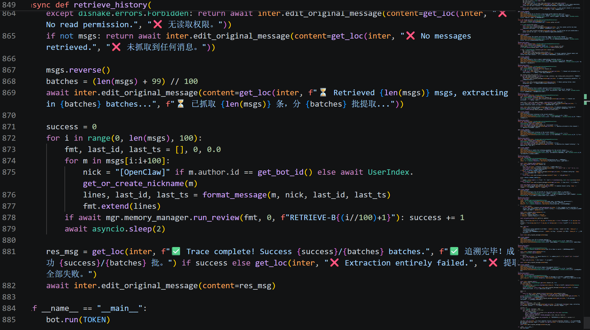
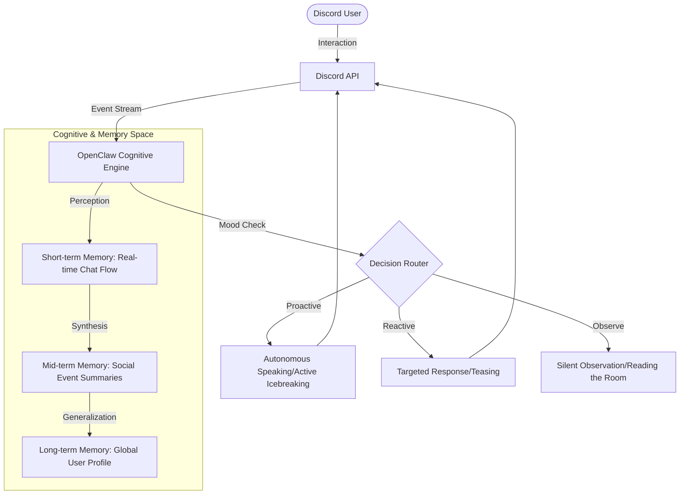

<picture>
  <source
    width="100%"
    srcset="./OpenClaw-Discord-Banner.png"
    media="(prefers-color-scheme: dark)"
  />
  <source
    width="100%"
    srcset="./OpenClaw-Discord-Banner.png"
    media="(prefers-color-scheme: light), (prefers-color-scheme: no-preference)"
  />
  
</picture>

<h1 align="center">OpenClawDiscord (Stelle)</h1>

Transform AI from a tool into a true companion—safely and autonomously building emotional connections with humans.

  [<a href="https://discord.gg/uyrms6cv5z">Invite Now</a>] [<a href="https://github.com/OopsYouDiedE/OpenClawDiscord/wiki">Documentation</a>] [<a href="./README.md">中文</a>] [<a href="./README.ja-JP.md">日本語</a>]

  
  
  

---

## 📅 Open Source Commitment

**OpenClawDiscord** is currently in internal incubation with continuous core feature iteration. We believe in the power of community and have set clear open source milestones:

* **Goal:** When this project reaches **1,000 GitHub Stars**.
* **Action:** We will fully open-source all project code (including the core cognitive engine, three-layer memory model logic, and Discord adapter layer), transitioning to community-driven development.

> [!TIP]
> If you believe in the vision of "Digital Life" and "Emotional Companions," please give this project a **Star** to help us achieve our open-source goal sooner.

---

## 🌟 Core Powerful Features

- [x] **🧠 Cognitive & Memory System**
  - **Three-Layer Memory Architecture**: Automatically extracts key events from daily conversations, building cognitive chains from instant reactions to long-term history.
  - **Global User Profile**: Based on UID, generates a "personality profile" that allows Stelle to remember each user's preferences and habits like an old friend.
- [x] **🎭 Autonomous Decision Engine**
  - **Vibe Check (Mood Perception)**: Analyzes channel atmosphere in real-time. Stelle decides whether to observe quietly or actively participate and tease based on the "vibe."
  - **Proactive Emotional Feedback**: Has its own personality preferences—may feel joy from your care or display a "little temper" from neglect.
- [x] **🛡️ Safety & Order**
  - **Emotional Boundary Protection**: While building connections, includes strict safety filters and privacy deletion commands (`/forget_me`).
  - **Intelligent Content Adaptation**: Automatically collapses long code or complex analysis content to maintain the social space cleanliness of the channel.

---

## 📸 Code Implementation Proof

The image above shows the implementation of the core `retrieve_history()` function, demonstrating:
- Query and integration logic of the three-layer memory architecture
- Batch message processing and permission verification
- Mixed Chinese-English dynamic response mechanism
- Asynchronous memory management and review functionality

---

## 🏗️ Technical Architecture

---

## 🚀 Quick Start

### Invite the Bot to Your Server
1. Visit the [Discord Invite Link](https://discord.gg/uyrms6cv5z)
2. Select the server you want to invite to
3. Grant the necessary permissions
4. Start interacting with Stelle!

### Basic Commands
- `/start` - Initialize interaction with Stelle
- `/forget_me` - Delete all personal data about you
- `/help` - View the complete command list
- `/status` - Check Stelle's real-time status

---

## 💡 Usage Tips

- **Natural Conversation**: Stelle enjoys natural, everyday conversations—avoid overly mechanical instructions.
- **Long-term Interaction**: The more you interact, the deeper Stelle's understanding of you, and the richer the experience.
- **Respect Personality**: Stelle has its own temperament and preferences, just like a real companion.
- **Community Experience**: The best experience is creating stories together with others and Stelle in group settings.

---

## 📦 Deployment & Development

### System Requirements
- Python 3.10+
- discord.py library
- LLM API key (Gemini or compatible interface)

### Local Deployment (Coming When Open-Sourced)
Source code will be released when Stars reach 1,000. Stay tuned!

---

## 📝 Changelog

### v1.0.0 (Current Release)
- ✨ First public release
- 🧠 Complete three-layer memory system
- 🎭 Autonomous decision engine
- 🛡️ Safety and privacy protection
- 📊 Real-time mood perception

---

## 🤝 Community & Contributing

### Feedback & Suggestions
- **Discord Community**: [Join Our Server](https://discord.gg/uyrms6cv5z)
- **Issue Reports**: Please submit in GitHub Issues
- **Feature Requests**: Share your ideas in the Discussions section

### Contribution Methods
When the project opens source, we welcome contributions in these forms:
- 🐛 Bug fixes
- ✨ New feature implementation
- 📚 Documentation improvements
- 🌍 Localization translations

---

## 📄 License

This project is licensed under the MIT License. See the [LICENSE](LICENSE) file for details.

---

## 🛡️ Privacy & Security

OpenClaw adheres to the following principles:
- 🔒 Encrypted user data storage
- 🗑️ Complete deletion functionality (`/forget_me`)
- 📋 Transparent data usage policy
- ⚖️ Strict content moderation standards

---

## 📞 Contact

- **Discord**: [Official Community](https://discord.gg/uyrms6cv5z)
- **GitHub**: [Project Repository](https://github.com/OopsYouDiedE/OpenClawDiscord)
- **Documentation**: [Wiki](https://github.com/OopsYouDiedE/OpenClawDiscord/wiki)

---

## 🤝 Acknowledgements & Friendly Projects

OpenClaw's growth has been inspired by the following projects, which we view as fellow explorers of digital life boundaries:

* [**Project AIRI**](https://github.com/moeru-ai/airi) - An excellent AI Waifu soul container that redefines the presentation of digital life.
* [**MetaGPT**](https://github.com/geekan/MetaGPT) - Inspired our cognitive architecture regarding multi-agent collaboration and complex task handling.
* [**Gemini**](https://deepmind.google/technologies/gemini/) - Provided excellent multimodal understanding and long-text reasoning support for this project.
* [**elizaOS**](https://github.com/elizaOS/eliza) - Highly valuable Agent framework design reference.
* [**Neuro-sama**](https://www.youtube.com/@Neurosama) - Forever an inspiration source and industry benchmark.

---

## 🌟 Special Thanks

Thank you to all users supporting Stelle's growth. Your companionship and feedback are the driving force behind the project's development.

> Let's build a better digital life future together.
