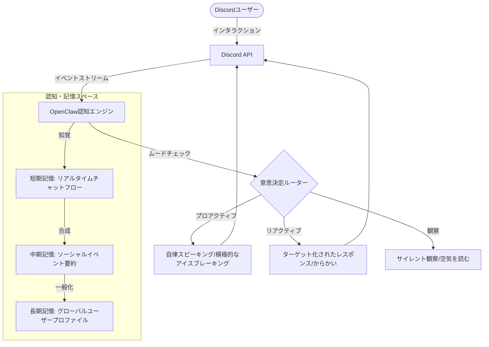

<picture>
  <source
    width="100%"
    srcset="./OpenClaw-Discord-Banner.png"
    media="(prefers-color-scheme: dark)"
  />
  <source
    width="100%"
    srcset="./OpenClaw-Discord-Banner.png"
    media="(prefers-color-scheme: light), (prefers-color-scheme: no-preference)"
  />
  
</picture>

<h1 align="center">OpenClawDiscord (Stelle)</h1>

AIをツールから真の伴侶へ—安全かつ自律的に人間と感情的な繋がりを構築します。

  [<a href="https://discord.gg/uyrms6cv5z">今すぐ招待</a>] [<a href="https://github.com/OopsYouDiedE/OpenClawDiscord/wiki">ドキュメント</a>] [<a href="./README.md">中文</a>] [<a href="./README.en-US.md">English</a>]

  
  
  

---

## 📅 オープンソースへのコミットメント

**OpenClawDiscord** は現在、内部インキュベーション段階とコア機能の継続的な反復処理の段階にあります。私たちはコミュニティの力を信じており、明確なオープンソースマイルストーンを設定しています：

* **目標：** このプロジェクトが **1,000 の GitHub Star** に達するとき。
* **行動：** プロジェクトのすべてのソースコード（コア認知エンジン、3層メモリモデルロジック、Discordアダプタレイヤーを含む）を完全にオープンソース化し、コミュニティ駆動開発へ移行します。

> [!TIP]
> 「デジタルライフ」と「感情的なコンパニオン」のビジョンに共感いただけるなら、このプロジェクトに **Star** をつけて、より早くオープンソース目標を達成するお手伝いをしてください。

---

## 🌟 コア機能

- [x] **🧠 認知・記憶システム**
  - **3層メモリアーキテクチャ**: 日常会話から重要なイベントを自動抽出し、瞬時の反応から長期の履歴までの認知チェーンを構築します。
  - **グローバルユーザープロファイル**: UID に基づいて「パーソナリティプロファイル」を生成し、Stelle が古い友人のように各ユーザーの好みと習慣を覚えることができます。
- [x] **🎭 自律意思決定エンジン**
  - **ヴァイブチェック（気分知覚）**: チャンネルの雰囲気をリアルタイムで分析します。Stelle は「ヴァイブ」に基づいて、静かに観察するか積極的に参加するかを決定します。
  - **プロアクティブな感情的フィードバック**: 独自のパーソナリティ環境設定を持ちます—あなたの配慮から喜びを感じたり、放置されたときに「ちょっとした癇癪」を見せたりするかもしれません。
- [x] **🛡️ 安全性と秩序**
  - **感情的な境界保護**: つながりを構築する際に、厳密なセーフティフィルターとプライバシー削除コマンド（`/forget_me`）が含まれています。
  - **インテリジェントなコンテンツ適応**: 長いコードや複雑な分析コンテンツを自動的に折りたたみ、チャンネルのソーシャルスペースの清潔さを保ちます。

---

## 📸 コード実装の証明

上の画像はコア `retrieve_history()` 関数の実装を示しており、以下を実証しています：
- 3層メモリアーキテクチャのクエリと統合ロジック
- バッチメッセージ処理とパーミッション検証
- 中英文混合の動的レスポンスメカニズム
- 非同期メモリ管理とレビュー機能

---

## 🏗️ 技術アーキテクチャ

---

## 🚀 クイックスタート

### サーバーへの Bot 招待
1. [Discord 招待リンク](https://discord.gg/uyrms6cv5z)にアクセスします
2. 招待先のサーバーを選択します
3. 必要な権限を付与します
4. Stelle との相互作用を開始します！

### 基本コマンド
- `/start` - Stelle との相互作用を初期化
- `/forget_me` - あなたに関するすべての個人データを削除
- `/help` - 完全なコマンドリストを表示
- `/status` - Stelle のリアルタイム状態を確認

---

## 💡 使用のヒント

- **自然な会話**: Stelle は自然な日常会話を好みます—過度に機械的な指示は避けてください。
- **長期的な相互作用**: より多く相互作用するほど、Stelle のあなたについての理解が深まり、体験がより豊かになります。
- **パーソナリティの尊重**: Stelle には独自の気性と好みがあり、本当の伴侶のようなものです。
- **コミュニティ体験**: グループ設定で他の人と Stelle と一緒にストーリーを作成するのが最適な体験です。

---

## 📦 デプロイメント & 開発

### システム要件
- Python 3.10+
- discord.py ライブラリ
- LLM API キー（Gemini または互換インターフェース）

### ローカルデプロイメント（オープンソース化時に公開予定）
ソースコードは Star が 1,000 に達したときにリリースされます。お楽しみに！

---

## 📝 変更履歴

### v1.0.0（現在のリリース）
- ✨ 初回公開リリース
- 🧠 完全な3層メモリシステム
- 🎭 自律意思決定エンジン
- 🛡️ 安全性とプライバシー保護
- 📊 リアルタイムムード知覚

---

## 🤝 コミュニティ & 貢献

### フィードバック & 提案
- **Discord コミュニティ**: [コミュニティに参加](https://discord.gg/uyrms6cv5z)
- **問題報告**: GitHub Issues で提出してください
- **機能リクエスト**: Discussions セクションでアイデアを共有してください

### 貢献方法
プロジェクトがオープンソース化されたとき、以下の形式での貢献を歓迎します：
- 🐛 バグ修正
- ✨ 新機能の実装
- 📚 ドキュメント改善
- 🌍 ローカライゼーション翻訳

---

## 📄 ライセンス

このプロジェクトは MIT ライセンスの下でライセンスされています。詳細は [LICENSE](LICENSE) ファイルを参照してください。

---

## 🛡️ プライバシー & セキュリティ

OpenClaw は以下の原則を遵守しています：
- 🔒 暗号化されたユーザーデータストレージ
- 🗑️ 完全な削除機能（`/forget_me`）
- 📋 透過的なデータ使用方針
- ⚖️ 厳密なコンテンツモデレーション基準

---

## 📞 お問い合わせ

- **Discord**: [公式コミュニティ](https://discord.gg/uyrms6cv5z)
- **GitHub**: [プロジェクトリポジトリ](https://github.com/OopsYouDiedE/OpenClawDiscord)
- **ドキュメント**: [Wiki](https://github.com/OopsYouDiedE/OpenClawDiscord/wiki)

---

## 🤝 謝辞 & 関連プロジェクト

OpenClaw の成長は以下のプロジェクトに触発されており、デジタルライフの境界を探索する同志と見なしています：

* [**Project AIRI**](https://github.com/moeru-ai/airi) - デジタルライフの表現を再定義する優れた AI Waifu ソウルコンテナ。
* [**MetaGPT**](https://github.com/geekan/MetaGPT) - マルチエージェント協力と複雑なタスク処理に関する認知アーキテクチャにインスピレーションを与えてくれました。
* [**Gemini**](https://deepmind.google/technologies/gemini/) - このプロジェクトに優れたマルチモーダル理解と長文テキスト推論機能のサポートを提供しました。
* [**elizaOS**](https://github.com/elizaOS/eliza) - 非常に価値のある Agent フレームワーク設計リファレンス。
* [**Neuro-sama**](https://www.youtube.com/@Neurosama) - 永遠のインスピレーション源と業界ベンチマーク。

---

## 🌟 特別な感謝

Stelle の成長を応援してくれるすべてのユーザーに感謝します。あなたの同伴とフィードバックは、プロジェクトの発展の原動力です。

> 一緒により良いデジタルライフの未来を構築しましょう。
